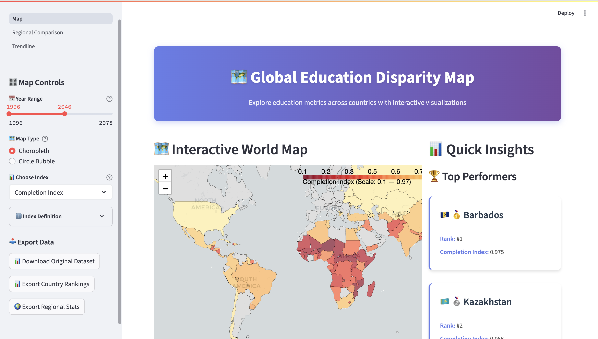
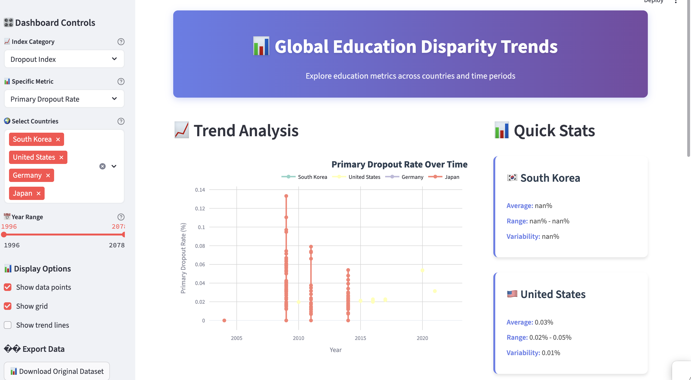

# 🌍 Global Education Disparity Dashboard

A comprehensive interactive Streamlit web application that visualizes global education metrics and disparities across countries and regions. This dashboard provides multiple views of education data including trend analysis, geographic mapping, and regional comparisons.

## 📊 Dashboard Overview



The dashboard offers three main analysis views:

### 🗺️ **Interactive World Map**
- **Choropleth and bubble map** visualizations
- **Country rankings** and performance metrics
- **Multiple education indices** (Completion, Attainment, Higher Education, Dropout)
- **Interactive tooltips** with detailed country information


### 📈 **Trend Analysis**
- **Time series analysis** of education metrics
- **Multi-country comparisons** with interactive charts
- **Quick statistics** with country flags
- **Trend line options** for statistical analysis



### 🌍 **Regional Comparison**
- **Geographic regions** (Europe, Asia, Africa, Americas, Oceania)
- **Economic regions** (High, Upper Middle, Lower Middle, Low Income)
- **Regional performance** analysis and rankings
- **Gap analysis** between best and worst performing regions


## 🚀 **Key Features**

### **📊 Multiple Education Metrics**
- **Completion Index**: Primary and secondary education completion rates
- **Attainment Index**: Education attainment levels by population
- **Higher Education Index**: University completion rates for adults 25-29
- **Dropout Index**: Primary, lower secondary, and upper secondary dropout rates

### **🎛️ Interactive Controls**
- **Year range filtering** for temporal analysis
- **Country selection** with search functionality
- **Metric selection** across different education dimensions
- **Display options** (markers, grid, trend lines)

### **📥 Data Export Capabilities**
- **Original dataset** download (education_data.csv)
- **Filtered data exports** based on current selections
- **Country rankings** with performance scores
- **Regional statistics** with aggregated metrics


### **🌍 Geographic Features**
- **Country flag emojis** for visual identification
- **Regional groupings** by geography and income level
- **Interactive tooltips** with ranking information
- **Color-coded visualizations** for easy interpretation

## 📋 **Data Sources**

The dashboard uses **World Bank Education Statistics** data including:
- **Primary completion rates** across countries
- **Secondary education** attainment levels
- **Higher education** completion statistics
- **Dropout rates** at various education levels

## 🛠️ **Technical Stack**

- **Streamlit**: Web application framework
- **Plotly**: Interactive visualizations
- **Folium**: Geographic mapping
- **Pandas**: Data manipulation and analysis
- **Custom CSS**: Modern, responsive design

## 📁 **File Structure**

```
education/
├── Map.py                          # Main map visualization
├── pages/
│   ├── Trendline.py               # Trend analysis dashboard
│   └── Regional_Comparison.py     # Regional comparison analysis
├── styles/
│   └── dashboard.css              # Custom styling
├── education_data.csv             # World Bank education dataset
├── world-countries.json           # GeoJSON for mapping
└── README.md                      # This file
```

## 🚀 **Getting Started**

### **Prerequisites**
```bash
pip install streamlit pandas plotly folium
```

### **Running the Dashboard**
```bash
streamlit run Map.py
```

### **Accessing Different Views**
- **Main Map**: Navigate to the home page
- **Trend Analysis**: Use the sidebar navigation
- **Regional Comparison**: Select from the page menu

## 📊 **Usage Examples**

### **Analyzing Education Trends**
1. Navigate to the **Trend Analysis** page
2. Select countries of interest
3. Choose education metrics to compare
4. Adjust year range for temporal analysis
5. Export results for further analysis

### **Comparing Regional Performance**
1. Go to the **Regional Comparison** page
2. Choose between geographic or economic regions
3. Select education metrics to analyze
4. View regional rankings and gap analysis
5. Download regional statistics

### **Exploring Global Patterns**
1. Use the **Interactive World Map**
2. Toggle between choropleth and bubble views
3. Hover over countries for detailed information
4. View top performers and rankings
5. Export country-level data

## 🤝 **Contributing**

This dashboard is designed for:
- **Educational researchers** analyzing global trends
- **Policy makers** comparing education outcomes
- **Data analysts** exploring education disparities
- **Students** learning about global education data

## 📄 **License**

This project uses World Bank data and is intended for educational and research purposes.

---

**Data Source**: World Bank Education Statistics  
**Last Updated**: 2024  
**Dashboard Version**: 1.0

